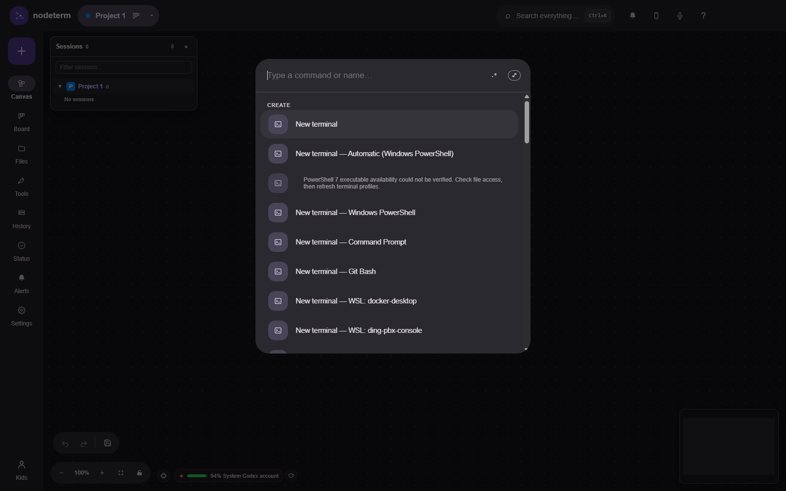
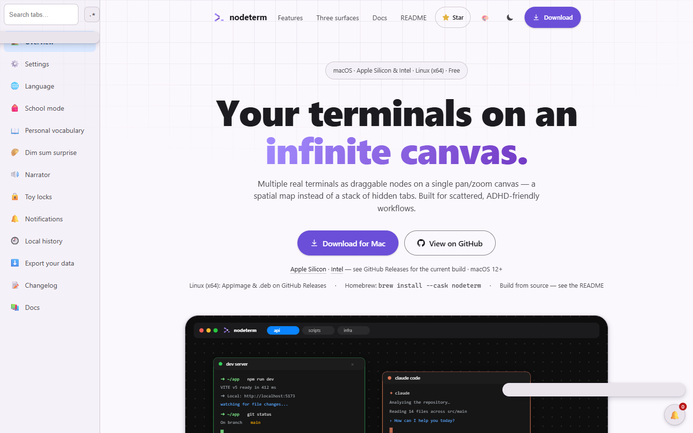
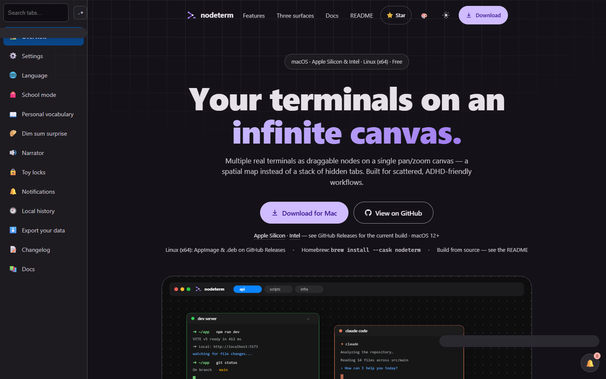
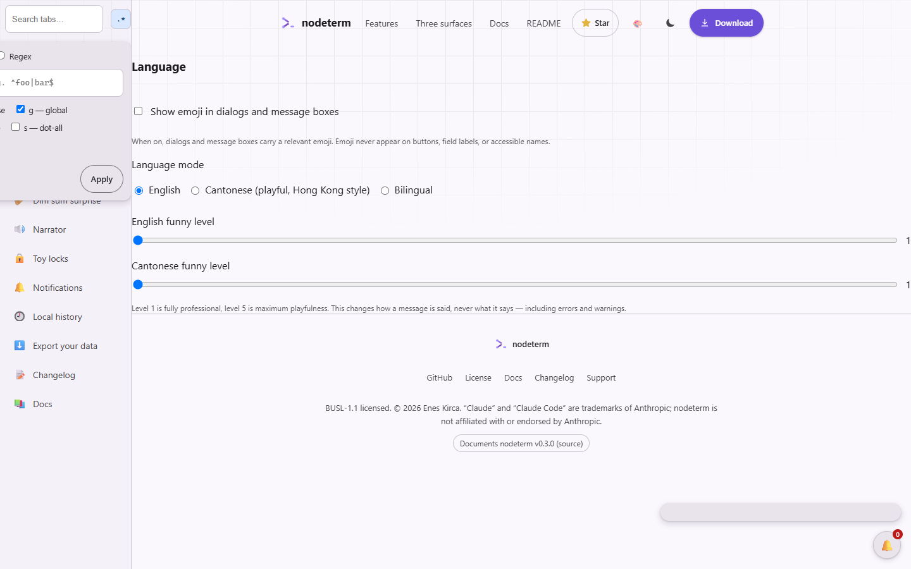
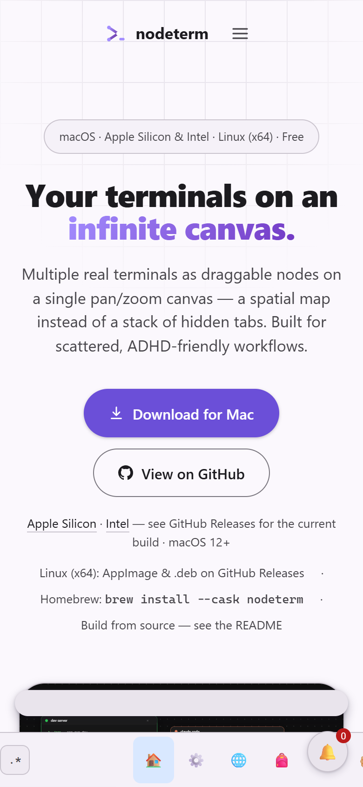

<div align="center">


# nodeterm

**A node-based terminal manager — your terminals and agents on an infinite canvas.**

Multiple real terminals live as draggable nodes on a single pan/zoom canvas, and every
project doubles as a **Trello-style board of live agent sessions**. Built for people with
ADHD and scattered workflows: a spatial layout instead of a stack of hidden tabs.

[](https://github.com/Ding-Ding-Projects/material-nodeterm/actions/workflows/ci.yml)
[%20·%20Linux-black)](#windows)
[](https://www.electronjs.org/)
[](./LICENSE)
[](https://github.com/Ding-Ding-Projects/material-nodeterm/stargazers)
[](https://github.com/Ding-Ding-Projects/material-nodeterm/releases)

**Install:** grab the latest build from **[Releases](https://github.com/Ding-Ding-Projects/material-nodeterm/releases)**
(Windows `Setup.exe` today — see [Windows](#windows) for the unsigned-installer note), or
build it yourself with `build.bat` / `build.sh` — see [Install / build](#install--build).

[Site](https://ding-ding-projects.github.io/material-nodeterm/) · [Releases](https://github.com/Ding-Ding-Projects/material-nodeterm/releases) · [Features](#-features) · [Windows](#windows) · [Build from source](#install--build) · [Documentation](#documentation) · [Contributing](#contributing) · [License](#license)

</div>

---

This is a fork of [eneskirca/nodeterm](https://github.com/eneskirca/nodeterm). The site's own
custom domain belongs to the upstream repository, so this fork publishes its documentation at
[ding-ding-projects.github.io/material-nodeterm](https://ding-ding-projects.github.io/material-nodeterm/)
instead — note the trailing `/material-nodeterm/`.

## Why nodeterm

Stacked terminal tabs hide context — you lose track of what's running where. nodeterm turns
that into a **map**: every shell is a node you can place, group, label, and zoom into. Sessions
are spatial and persistent, so your mental model stays intact across restarts. And because the
app is built around a clean service seam, the same canvas runs two ways: as the **desktop
app** (Windows, macOS and Linux), and as a **self-hosted browser app** you reach from anywhere
(Server Edition) — including from a phone, with no app to install.

## ✨ Features

### The canvas

Right-click the canvas to open a **terminal** or an **agent** node. Each runs in its own
persistent session next to **sticky notes** (link one to a terminal to feed it context on
demand), **Monaco editors**, and **diff views** — six node kinds in total, all panning,
zooming, resizing and persisting the same way. **Group** nodes are real containers that can
nest inside each other and optionally bind to a git worktree, so every node created inside one
inherits that worktree's directory. Quit the app and its persistent backend reattaches to the
live session. Restart the machine and cold restore reconstructs the node, replays saved scrollback,
and resumes a supported agent CLI; it does not preserve the original OS process.

### Agent support — Claude Code, Codex, Gemini, opencode, Grok, or your own

An **agent** node is a terminal preset that launches an agent CLI as its first command. Status
is driven entirely by each agent's own hooks — never by scraping terminal output — so you get
pulsing **RUNNING / NEEDS YOU** badges, a per-node context-window meter, subagent cards with
live transcripts, and (for capable agents) session renaming and conversation branching. A
custom command works too, with basic process/title status. See
[`docs/features/agents/agent-support.md`](./docs/features/agents/agent-support.md) for exactly
which capability each agent has.

### One project, two views — the kanban board

Every project is a canvas **and also a Trello-style board**. Cards *are* your live session
nodes, derived from the same data every time the board renders — drag one across columns while
its agent keeps running, or open a card into a live modal (the real session, plus members, due
date, priority and comments). The canvas stays mounted underneath the board, so nothing running
is ever interrupted by switching views.

### Session continuity

Every terminal node runs inside a persistent [tmux](https://github.com/tmux/tmux) session on
macOS and Linux, so a shell — and anything running in it, including an in-flight agent turn —
survives closing a node, switching projects, and quitting the app. A machine reboot ends the live
process; the cold-restore path replays saved scrollback and resumes supported agent conversations.
**Windows has no tmux binary to bundle**, so nodeterm ships a from-scratch equivalent instead:
the [Windows session host](#windows), a standalone process that owns the real PTYs and outlives
the app. See [Windows](#windows) for its two honest caveats.

### Remote & SSH, and the Server Edition

Point a project at a folder on a remote host and every terminal, file operation, git command
and even the kanban board for that project run there while the canvas stays local — session
continuity applies remotely too. Or run nodeterm's **Server Edition**: the exact same renderer,
served headless over plain HTTP/WebSocket from a Linux (or macOS) box you own, reached from any
browser, with passkey or password auth. One command (`./host.sh`) builds and starts it in a
container. Phone pairing — so a browser on your phone can reach the terminals on your desktop
too — is a Core feature, not a paywalled one.

### Source control and git worktrees

A full git panel — stage/unstage, discard, diff nodes, branch switch/create, commit (with an
optional AI-generated commit message from a local agent CLI you already have), push/sync,
`gh` sign-in. **Worktrees bind to group frames**: create one from the panel or command palette
and every node you open inside that frame runs in that worktree — an agent per branch is just a
group per branch.

### Dictation

Voice-to-text for any terminal or agent node, transcribed entirely on-device with
[Whisper](https://github.com/openai/whisper) — nothing you say leaves your machine. Hold the
dictation chord, speak, and choose **Send** (submits it) or **Insert** (drops it in without
submitting). Works identically on desktop and in the Server Edition's browser tab.

<details>
<summary><strong>More — language modes, the regex builder, toy locks, exports, and everything else this fork adds</strong></summary>

- **Language modes & funny-level sliders** — English, playful Hong Kong-style Cantonese, or
  bilingual, plus two independent funny-level sliders (one per language) that style every
  dialog and message box without changing what they actually say. See
  [`docs/language-modes.md`](./docs/language-modes.md).
- **Regex builder** — a real, in-app pattern builder wired into every search field in the app,
  not a link to an external site. Plain text by default, regex an explicit opt-in. See
  [`docs/regex-builder.md`](./docs/regex-builder.md).
- **School mode** — a shared, renamable focus switch that, while on, presents the app in plain
  English with Cantonese, funny levels, the dim-sum surprise and personal vocabulary treated as
  not installed. A user-experience switch, not a security boundary. See
  [`docs/school-mode.md`](./docs/school-mode.md).
- **Personal vocabulary** — upload a small local JSON file of your own `term → replacement`
  pairs and the app's own prose adopts your wording. Local and private; nothing is ever
  uploaded anywhere. See [`docs/personal-vocabulary.md`](./docs/personal-vocabulary.md).
- **Narrator** — an opt-in spoken TTS narrator for app events (an agent finishing, needing
  attention, or erroring), off by default. See [`docs/narrator.md`](./docs/narrator.md).
- **Toy locks & the built-in authenticator** — a purely-for-fun password/TOTP gate you can put
  on a project tab, a canvas node, or an appearance setting, plus a local offline place to keep
  arbitrary TOTP secrets and read live codes. Explicitly *not* a security boundary — see
  [`docs/toy-locks.md`](./docs/toy-locks.md) and [`docs/authenticator.md`](./docs/authenticator.md).
- **Exports & bulk actions** — every record, view, list and generated artifact nodeterm owns is
  exportable in whatever formats can faithfully represent it, and every list/table/grid
  supports select-all, bulk delete/export/move with a reviewable preview first. See
  [`docs/exports.md`](./docs/exports.md) and [`docs/bulk-actions.md`](./docs/bulk-actions.md).
- **Universal file converter** — a local, offline conversion surface (documents/PDF, images,
  audio, video, archives, structured data, code/text, binary encodings) reachable from the
  canvas controls or the command palette. See [`docs/file-converter.md`](./docs/file-converter.md).
- **Local Ollama suite manager** — a local manager for [Ollama](https://ollama.com) that talks
  only to its documented local HTTP API, never a cloud service. See
  [`docs/ollama-manager.md`](./docs/ollama-manager.md).
- **Scheduled settings** — rules that automatically overlay appearance/customization settings
  for a date+time window ("dark theme after 22:00"), with an optional Home Assistant boolean
  source. See [`docs/scheduled-settings.md`](./docs/scheduled-settings.md).
- **Appearance editor & infinite colour picker** — a non-modal, anchored editor that can
  re-typeset a tab, a node title, or a piece of app chrome, backed everywhere by one continuous
  colour field (never a fixed swatch list) with a colour-space translator. See
  [`docs/appearance.md`](./docs/appearance.md) and [`docs/colour-picker.md`](./docs/colour-picker.md).
- **The dim-sum surprise** — a 10% chance at startup of a small, non-blocking card showing one
  randomly chosen dim-sum dish, bilingual name and all. Entirely optional, never gates
  anything. See [`docs/dim-sum.md`](./docs/dim-sum.md).
- **Command palette** — `Ctrl+Shift+F` (and `Cmd/Ctrl+K`, unchanged) opens a palette over every
  command, setting and destination in the app. See [`docs/command-palette.md`](./docs/command-palette.md).

</details>

## Windows

Windows is a first-class desktop target: a native **Squirrel.Windows** installer, a
Windows-shaped default shell (PowerShell/cmd, not `bash`), and a Material title bar with native
window buttons.

**The installer is unsigned.** Code signing is permanently out of scope for this project (see
`CLAUDE.md`'s "Permanent no-signing policy"), so Windows SmartScreen will very likely show a
**"Windows protected your PC"** interstitial the first time you run `Setup.exe` — click **More
info**, then **Run anyway**. This is expected of every unsigned installer from any publisher; it
is not a sign of a corrupted download, and it is not something this project will ever silently
work around by acquiring a certificate.

**Session continuity works, through a different mechanism.** There is no Windows build of tmux
to bundle, so Windows terminals are backed by the **Windows session host** instead — a
standalone Node process, built on the same `node-pty` this app already depends on plus a
headless `xterm.js` for server-side screen state, that owns the real PTYs and outlives the
Electron app. It is selected automatically whenever no real tmux is found on `PATH` (which is
always, on a stock Windows install), and it gives you the same practical guarantee: close the
app, reopen it, and your terminals — and any in-flight agent CLI turn — are still there,
scrollback and all.

Two honest caveats, in the spirit of tmux's own trade-offs:

- **If the session-host process itself dies, its sessions die with it.** It is a standalone
  process this project maintains, not a decades-old, independently-shipped C daemon — a weaker
  guarantee than real tmux, stated plainly rather than glossed over.
- **A machine reboot ends every session either way** — that is true of tmux too. What survives a
  reboot is the **cold-restore path**: a periodically saved scrollback snapshot is replayed into
  the freshly reattached terminal, and a resumable agent CLI is automatically relaunched with
  its own `--resume`/equivalent flag, so you land back roughly where you left off even though
  the underlying process itself did not survive.

If you want tmux-grade durability instead, install a real tmux somewhere on your Windows
`PATH` (MSYS2's `pacman -S tmux`, or Cygwin's tmux package) — nodeterm prefers a system tmux
over its own session host every time one is found. Full detail, architecture, and the protocol
table: [`docs/windows-session-host.md`](./docs/windows-session-host.md) and
[`docs/windows.md`](./docs/windows.md).

## Install / build

Three scripts live at the repository root, each with a Windows `.bat` and a POSIX `.sh`
sibling. A checkout with nothing installed should reach a running app (or a real installer) by
running one of them:

| Script | Windows | macOS / Linux | What it does |
| --- | --- | --- | --- |
| Dependencies | `download-dependencies.bat` | `download-dependencies.sh` | Installs Node.js (if missing) and every npm dependency, from canonical upstreams into a user-scoped location. |
| Build | `build.bat` | `build.sh` | Runs the dependency script, builds `out/`, then offers to launch the app. |
| Installer | `build-installer.bat` | `build-installer.sh` | Runs the dependency script, then packages and verifies the real platform installer (Squirrel on Windows, `.dmg`/`.zip` on macOS, `.AppImage`/`.deb` on Linux). |

All three accept a silent flag (`/s` / `--silent` on Windows, `-s` / `--silent` elsewhere, or a
`SILENT=1` environment variable) for unattended use, and exit non-zero on the first real
failure. None of them ever installs a secret, a credential, or a code-signing certificate.

<details>
<summary><strong>npm scripts, once dependencies are installed</strong></summary>

```bash
npm install        # deps + rebuilds node-pty against Electron's ABI (postinstall hook)
npm run dev         # dev mode with renderer HMR
npm run build       # production build into out/
npm start           # preview the production build
npm run typecheck   # tsc for both the main/preload and renderer projects
npm test            # vitest (unit + integration)
npm run dist:win     # package the Windows Squirrel installer
npm run dist         # package the macOS .dmg + .zip
npm run dist:linux   # package the Linux .AppImage + .deb
npm run server:dev   # build and run the Server Edition
```

</details>

Full detail on every script, including the Windows batch-file traps this project has already
hit and fixed (`NoDefaultCurrentDirectoryInExePath`, CRLF-only `.bat` line endings, the
package-manager `PATH` refresh race): [`docs/building.md`](./docs/building.md).

## Documentation

| Where | What's there |
| --- | --- |
| [Documentation site](https://ding-ding-projects.github.io/material-nodeterm/) | The landing page and browsable docs, published from `site/`. |
| [`docs/features/`](./docs/features/README.md) | One article per feature — behaviour, configuration, failure modes, security, verification — grouped by category. |
| [`docs/app-contract.md`](./docs/app-contract.md) | The desktop app's hand-written feature-completeness guard (`npm run check:app-contract`) — what it checks and why, alongside the site's `check-site-contract.mjs`. |
| [`CLAUDE.md`](./CLAUDE.md) | The deep architecture reference: process boundaries, every subsystem's invariants and the reasoning behind them. |
| [`CONTRIBUTING.md`](./CONTRIBUTING.md) | Setup, the process-boundary rules, and the house rules a PR gets sent back for. |
| [`AGENTS.md`](./AGENTS.md) | Guidance for coding agents working in this repository. |
| [`CHANGELOG.md`](./CHANGELOG.md) | What actually shipped, release by release. |

## Screenshots

Real captures of the built app and the live site — every image below was taken from a running
build or the deployed site, never mocked up and never reused from upstream. The full manifest
(what each shows, the commit, the exact capture method) is in
[`docs/assets/shots/README.md`](./docs/assets/shots/README.md).

<details>
<summary><strong>The desktop app</strong> — settings, the command palette, and the features this fork adds</summary>

| | |
| --- | --- |
|  |  |
| **Settings** — the tabbed surface, its search field with the regex-builder affordance beside it, and per-agent capability controls. | **Narrator** — off by default, with a *separate* voice picker per language and a live line saying which voice will actually speak. |
|  |  |
| **Language** — three modes, and two funny-level sliders that change tone without changing what a message says. | **Command palette** — every command, destination and setting, with a persisted size. |

|  |  |
| **The canvas** — a project with a live terminal node, sessions sidebar, minimap and dock. | **The same project as a board** — cards *are* the session nodes; Ungrouped holds anything unassigned. |

Also captured: [the appearance editor](./docs/assets/shots/app-settings-appearance-editor.png),
[app name & logo](./docs/assets/shots/app-settings-app-identity.png),
[scheduled settings](./docs/assets/shots/app-settings-schedule.png), and
[the app at launch](./docs/assets/shots/app-01-launch.png).

</details>

<details>
<summary><strong>The site</strong> — light and dark, the regex builder, and a phone layout</summary>

| | |
| --- | --- |
|  |  |
| **Home, light.** | **Home, dark.** |
|  |  |
| **The regex builder**, anchored to the field it belongs to. | **390px phone width** — measured to have no sideways scroll. |

</details>

**Not yet captured, and honestly absent rather than staged:** an agent mid-turn (the
RUNNING / NEEDS YOU badge and a subagent fan-out), and the Squirrel installer's SmartScreen
prompt. The canvas shot above shows a real, live terminal session, but its pane is empty — see
[the manifest](./docs/assets/shots/README.md) for why, and for the two captures that were taken
and discarded rather than shipped.

## Contributing

See [`CONTRIBUTING.md`](./CONTRIBUTING.md) for setup, the process-boundary rules
(`src/main` / `src/core` / `src/preload` / `src/renderer` / `src/server`), and the testing
habits this repository expects.

## License

[Business Source License 1.1](./LICENSE) (BUSL-1.1) — you may copy, modify, create derivative
works from, and make non-production use of nodeterm freely, plus a production-use grant that
excludes offering it to third parties on a hosted/embedded basis or as a competing commercial
product or service. On the fourth anniversary of a given version's first public release (or the
license's stated Change Date, whichever comes first), that version automatically converts to the
**MIT License**.
