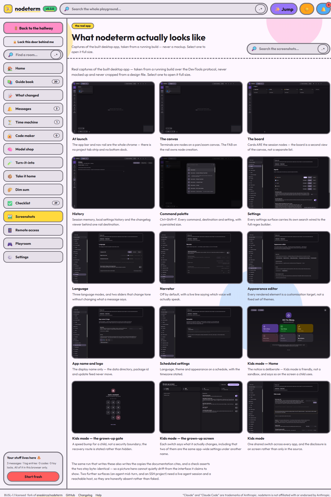

<div align="center">


# nodeterm

**Your terminals and coding agents on one infinite canvas.**

Real shells live as draggable nodes on a pan/zoom canvas instead of behind a row of tabs, and
every project doubles as a **board of live agent sessions**. Built for people whose work does not
fit in a stack of hidden tabs — a map you arrange, not a list you scroll.

[](https://github.com/Ding-Ding-Projects/material-nodeterm/actions/workflows/ci.yml)
[%20·%20Linux-black)](#windows)
[](https://www.electronjs.org/)
[](#the-interface)
[](./LICENSE)
[](https://github.com/Ding-Ding-Projects/material-nodeterm/stargazers)
[](https://github.com/Ding-Ding-Projects/material-nodeterm/releases)

[Site](https://ding-ding-projects.github.io/material-nodeterm/) · [Releases](https://github.com/Ding-Ding-Projects/material-nodeterm/releases) · [Features](#-features) · [Windows](#windows) · [Build from source](#install--build) · [Documentation](#documentation) · [Contributing](#contributing) · [License](#license)

</div>


> **Install:** grab the latest build from **[Releases](https://github.com/Ding-Ding-Projects/material-nodeterm/releases)**
> (Windows `Setup.exe` today — see [Windows](#windows) for the unsigned-installer note), or build
> it yourself with `build.bat` / `build.sh` — see [Install / build](#install--build).

This is a fork of [eneskirca/nodeterm](https://github.com/eneskirca/nodeterm). The site's own
custom domain belongs to the upstream repository, so this fork publishes its documentation at
[ding-ding-projects.github.io/material-nodeterm](https://ding-ding-projects.github.io/material-nodeterm/)
instead — note the trailing `/material-nodeterm/`.

## Why nodeterm

Stacked terminal tabs hide context — you lose track of what is running where. nodeterm turns that
into a **map**: every shell is a node you can place, group, label and zoom into. Sessions are
spatial and persistent, so your mental model survives a restart. And because the app is built
around a clean service seam, the same canvas runs two ways: as the **desktop app** (Windows,
macOS, Linux) and as a **self-hosted browser app** you reach from anywhere — including a phone,
with nothing to install.

## The interface
<table>
<tr>
<td width="42%" valign="middle">

### Everything is a node

Right-click the canvas to open a **terminal** — or an AI **agent**. Each runs in its own
persistent tmux session, next to **sticky notes** (link one to feed an agent context),
**Monaco editors**, **diff views**, and **web/video** nodes — arranged spatially, like a
map. Quit the app, even **restart the machine** — every session comes back.

</td>
<td></td>
</tr>
<tr>
<td width="42%" valign="middle">

### Know when an agent needs you

Hook-driven status — no output scraping: pulsing **RUNNING / NEEDS YOU** badges,
**subagent** cards with live transcripts, a per-node **context meter**, and OS
notifications. Click the ping, answer the permission prompt right in the node, and get
told the moment the turn is **done**. On a MacBook, agents live in the **notch** too.

</td>
<td></td>
</tr>
<tr>
<td width="42%" valign="middle">

### One project, two views

Every project is a canvas — **and also a kanban board**. Cards *are* your live
sessions: drag them across columns while the agent keeps running, open a card into a
**live card modal** (the real session + members, due date, priority, comments), and
assign teammates. Toggle with `⌘⇧B`.
<br/><sub>▶ <a href="docs/assets/kanban-launch.mp4">Watch the board video with sound</a></sub>

</td>
<td></td>
</tr>
<tr>
<td width="42%" valign="middle">

### Your sessions, anywhere

**Pair your phone** with one QR — *scan with the nodeterm iOS app* — and the **same
live session continues in your pocket**, E2E encrypted **over the relay, not just your
LAN**. The same canvas also runs self-hosted in any browser (Server Edition).

</td>
<td></td>
</tr>
<tr>
<td width="42%" valign="middle">

### Talk to your terminal

Hold `⌘⌥` and say it. On-device **Whisper** transcribes locally — review the text,
then **Send** (nothing auto-submits). Your voice never leaves the machine.

</td>
<td></td>
</tr>
</table>

### Node kinds

🖥 **Terminal** (xterm + tmux, AI naming) · 🤖 **Agent** (Claude Code / Codex / Gemini /
GitHub Copilot / opencode / Grok / custom) · 📝 **Sticky note** (link to an agent as context) · 🗂 **Group**
(bind to a **git worktree** for agent-per-branch) · ✏️ **Editor** (Monaco, ⌘S) ·
🔀 **Diff** · 🌐 **Web / Video**

### More

- **Session continuity (tmux)** — terminals keep running across node remounts *and* full
  app restarts, including live processes; machine reboots restore scrollback and resume
  agent sessions (`claude --resume`). The macOS app **ships its own tmux**, so this works
  with nothing installed; a tmux already on your system is always used in preference to it,
  and terminals opened before an upgrade stay as they were until you refresh the node.
- **Talk to your terminal** — on-device Whisper dictation (hold ⌘⌥): speak, review, send.
- **Agent superpowers** — **context links** so agent nodes read each other's transcripts
  on demand; Claude-only **branch a conversation** and **managed accounts** for several
  logged-in Claude identities side by side; agents can drive the canvas (open nodes,
  spawn teams, verify each other's work) via the built-in canvas-control CLI.
- **Remote / SSH projects** — open a project on a remote host over SSH; terminals, files,
  git, and even the board run there while the canvas stays local.
- **Source control** — VS Code-style stage/unstage, discard, branch switch/create,
  commit, push/sync/publish, **worktrees**, and `gh` sign-in — backed by system `git`.
- **GitHub Issues on Kanban** – opt-in issue cards, exact label-to-column mapping,
  All / GitHub / Sessions filtering, and two-way move, close, and reopen sync. See
  [setup and security details](./docs/github-issues-kanban.md).
- **AI commit messages & terminal names** — bring-your-own local agent CLI run read-only
  on the staged diff or captured output.
- **Your sessions, in your pocket** — **nodeterm mobile** (iOS) attaches to the same live
  tmux sessions: watch an agent work, answer a "needs you", or type into any terminal
  from your phone — plus push notifications and a mobile board view.
- **Power & sleep** — while an agent is working, nodeterm keeps the machine from
  idle-sleeping, and lets go the moment it finishes (on by default; toggle in the setup
  tour or Settings → Behavior). No app can hold a machine awake through a closed lid —
  for overnight runs keep the laptop open and plugged in, or run the agents on a box
  that doesn't sleep via the [Server Edition](./docs/SERVER.md).
- **Command palette** (⌘K), **file explorer** (⌘⇧E), **markdown view** (⌘M),
  **undo/redo**, and a native macOS dark UI.
- **Auto-update & in-app announcements** — the app checks a self-hosted feed and
  surfaces a "Restart to update" banner and product news.

### 🌍 Server Edition — nodeterm in your browser

The same canvas runs headless on a Linux (or macOS) host and is used from any browser —
so your terminals, editors, source control, board, and agents live on a server you reach
from anywhere. Single-user auth (password + secure cookie), a WebSocket bridge, and the
exact same renderer as the desktop app.

The whole app is **Material Design 3** — one baseline scheme seeded at `#6750A4`, tonal elevation
rather than drop shadows, and Outfit / Roboto Mono / Material Symbols bundled and subsetted so it
renders identically offline. A 64px top app bar carries the brand, the project switcher and a
docked search; an 88px nav rail carries the destinations and a FAB that owns node creation.

Every colour, typeface, size, weight, radius and spacing the app renders is adjustable at runtime
through the appearance editor, and every colour control is a continuous field with a colour-space
translator rather than a fixed list of swatches.

### Watch it run


A still proves a surface exists. This proves it moves. It is a real recording of the built
artifact, driven by [`scripts/record-app.mjs`](./scripts/record-app.mjs) against a disposable
profile, and it is frames of the app's own renderer: nothing here captures a screen, a desktop or
any other window. Provenance, including the commit it was recorded at, sits beside it in
[`app-walkthrough.json`](./docs/assets/app-walkthrough.json).

<details>
<summary><strong>See it</strong> — real captures of the built app, not mockups</summary>

Every image below was taken from the built `out/` artifact over the DevTools protocol by
[`scripts/capture-shots.mjs`](./scripts/capture-shots.mjs), which fails the run when a required
surface cannot be reached. Provenance for each is in
[`capture-manifest.json`](./docs/assets/shots/capture-manifest.json).

| | |
| --- | --- |
|  |  |
| **Command palette** — every command, destination and setting behind `Ctrl+Shift+F`. | **The same project as a board** — cards *are* the session nodes, not a separate list. |
|  |  |
| **History** — session memory, local settings history and the changelog viewer. | **Settings** — every surface carries its own search, wired to the full regex builder. |
|  |  |
| **Language** — three modes, and two sliders that change tone without changing the facts. | **Narrator** — off by default, with a live line saying which voice will actually speak. |
|  | |
| **ADHD modes** — five accommodations, switched on independently, all off by default. | |

Kids mode ships its own screens, captured the same way:

| | |
| --- | --- |
|  |  |
| **Kids home** — the disclosure sits on the screen the child uses. | **The grown-up screen**, behind a PIN gate that the docs call a speed bump, not security. |

Also captured: [at launch](./docs/assets/shots/app-01-launch.png),
[the appearance editor](./docs/assets/shots/app-settings-appearance-editor.png),
[app name & logo](./docs/assets/shots/app-settings-app-identity.png),
[scheduled settings](./docs/assets/shots/app-settings-schedule.png),
[the Kids gate](./docs/assets/shots/app-kids-gate.png) and
[Kids mode settings](./docs/assets/shots/app-settings-kids-mode.png).

Two surfaces are deliberately **absent** rather than faked — an agent mid-turn and an SSH project
need a live agent session and a reachable host, so the harness skips them loudly and lists why.

</details>

## ✨ Features
**Trying it out?** Removal is one script — it stops every process nodeterm started, reverts
the status-hook/skill entries it merged into your agent CLIs' config (your own hooks and
credentials are never touched), and deletes all of nodeterm's own state. Run it with
`--dry-run` first to see the full list of what it found:

```bash
curl -fsSL https://raw.githubusercontent.com/eneskirca/nodeterm/main/scripts/uninstall.sh | bash -s -- --dry-run
curl -fsSL https://raw.githubusercontent.com/eneskirca/nodeterm/main/scripts/uninstall.sh | bash -s -- --yes
```

The full inventory of what nodeterm writes where (and what the script keeps, like the
`.nodeterm/` canvas folders inside your own repos) is documented in
[docs/uninstall.md](docs/uninstall.md).

## 🛠 Build from source

### The canvas

Right-click to open a **terminal** or an **agent** node. Alongside them live **sticky notes**
(link one to a terminal to feed it context on demand), **Monaco editors**, **diff views**, web and
browser views, annotations, and a family of **service managers** — Minecraft, Docker host,
Proxmox, GitLab, Home Assistant and FreePBX — each an ordinary node you drag, colour, group and
persist like any other, because a managed service is something you arrange beside the terminals
working on it, not a modal you visit.

The canvas also includes a **Torrent Downloader** node for explicit local WebTorrent tasks, with
magnet or `.torrent` intake, safe destination selection, file-level metadata choices, live transfer
progress, restart recovery, and a bounded per-task seeding policy.

**Group** nodes are real containers that nest inside each other and can bind to a git worktree, so
every node created inside one inherits that worktree's directory. Quit the app and the persistent
backend reattaches to the live session; reboot the machine and cold restore rebuilds the node,
replays saved scrollback and resumes a supported agent CLI — it does not preserve the original OS
process, and says so.

Each Multiverse and AWS Universe child canvas also owns one fixed **Shop** node. It opens the
scope-bound catalog, keeps a deterministic identity across import, hydration, undo and peer replay,
and refuses deletion, duplication, grouping, or movement. Live choices are handed to the unified
Node Catalog creation coordinator with immutable event ids and collision-free placement. The root
canvas has no Shop. See the
[special-universe Shop article](./docs/features/integrations/aws-universe-shop.md) for the
portable metadata, repair records, disabled AWS entries, and verification boundary.

A project can now create and navigate a scoped **Multiverse canvas hierarchy** from the canvas app
bar. The guided parent picker searches names, depths, and identifiers with its adjacent regex
builder, explains why depth-8 parents cannot accept another child, and preserves each child canvas
through ordinary project files and portable schema 3 import and export. See the
[Multiverse child canvases article](./docs/features/canvas/multiverse-canvases.md).

### Agent support — Claude Code, Codex, Gemini, opencode, Grok, or your own

An **agent** node is a terminal preset that launches an agent CLI as its first command. Status
comes from each agent's own hooks — never from scraping terminal output — so you get pulsing
**RUNNING / NEEDS YOU** badges, a per-node context-window meter, subagent cards with live
transcripts, and, for capable agents, session renaming and conversation branching. A custom
command works too, with basic process/title status.

Capabilities are per agent and none are assumed: see
[`docs/features/agents/agent-support.md`](./docs/features/agents/agent-support.md) for exactly what
each one has, and what it does not.

### One project, two views — the kanban board

Every project is a canvas **and** a Trello-style board. Cards *are* your live session nodes,
derived from the same data on every render — drag one across columns while its agent keeps
running, or open a card into a live modal holding the real session plus members, due date,
priority and comments. The canvas stays mounted underneath, so switching views never interrupts
anything.

### Session continuity

Every terminal runs inside a persistent [tmux](https://github.com/tmux/tmux) session on macOS and
Linux, so a shell — and anything in it, including an in-flight agent turn — survives closing a
node, switching projects and quitting the app. **Windows has no tmux binary to bundle**, so
nodeterm ships a from-scratch equivalent: the [Windows session host](#windows), a standalone
process that owns the real PTYs and outlives the app. See [Windows](#windows) for its two honest
caveats.

### Remote & SSH, and the Server Edition

Point a project at a folder on a remote host and every terminal, file operation, git command and
even the kanban board for that project runs there while the canvas stays local — session
continuity applies remotely too. Or run the **Server Edition**: the same renderer served headless
over HTTP/WebSocket from a host you own, reached from any browser, with passkey or password auth.
One command (`./host.sh`, or `host.bat` on Windows) builds and starts it in a container. Phone
pairing is a free feature, not a paywalled one.

### Source control and git worktrees

A full git panel — stage/unstage, discard, diff nodes, branch switch/create, commit (with an
optional AI-generated message from a local agent CLI you already have), push/sync, `gh` sign-in.
**Worktrees bind to group frames**: create one from the panel or the command palette and every
node opened inside that frame runs in that worktree, so an agent per branch is just a group per
branch.

### ADHD modes

This README has always said nodeterm is built for scattered workflows. These are the part you
can actually switch on — five accommodations, independently, all off by default:
**Focus** (fades everything but the node you are in), **Low stimulation** (less motion, quieter
colour, and only the notifications that need an answer), **Time awareness** (elapsed time on the
node, not in a menu), **One thing at a time** (one next action, in your words), and **Momentum**
(a note when something has sat untouched).

Independent on purpose: someone may want a quieter interface without time nudges, or want the
nudges precisely because they are hyperfocusing. Behind one master switch, most people turn the
lot off to escape the single part that does not suit them.

Focus **dims and never hides** — nothing becomes unreachable, at any setting. The copy states
facts and never verdicts: no streaks, no scores, no congratulation. And none of it is presented
as medical: these are interface accommodations, not assessment or advice, and nothing is
recorded or sent anywhere. See [`docs/adhd-modes.md`](./docs/adhd-modes.md).

### Dictation

Voice-to-text for any terminal or agent node, transcribed entirely on-device with
[Whisper](https://github.com/openai/whisper) — nothing you say leaves your machine. Hold the
chord, speak, then choose **Send** (submits) or **Insert** (drops it in without submitting).
Identical on desktop and in the browser.

<details>
<summary><strong>More — language modes, the regex builder, toy locks, exports, and everything else this fork adds</strong></summary>

- **Language modes & funny-level sliders** — English, playful Hong Kong-style Cantonese, or
  bilingual, plus two independent funny-level sliders (one per language) that style every
  dialog and message box without changing what they actually say. See
  [`docs/language-modes.md`](./docs/language-modes.md).
- **Regex builder** — a real, in-app pattern builder wired into every search field in the app,
  not a link to an external site. Plain text by default, regex an explicit opt-in. See
  [`docs/regex-builder.md`](./docs/regex-builder.md).
- **School mode** — a shared, renamable focus switch that, while on, presents the app in plain
  English with Cantonese, funny levels, the dim-sum surprise and personal vocabulary treated as
  not installed. A user-experience switch, not a security boundary. See
  [`docs/school-mode.md`](./docs/school-mode.md).
- **Personal vocabulary** — upload a small local JSON file of your own `term → replacement`
  pairs and the app's own prose adopts your wording. Local and private; nothing is ever
  uploaded anywhere. See [`docs/personal-vocabulary.md`](./docs/personal-vocabulary.md).
- **Narrator** — an opt-in spoken TTS narrator for app events (an agent finishing, needing
  attention, or erroring), off by default. See [`docs/narrator.md`](./docs/narrator.md).
- **Toy locks & the built-in authenticator** — a purely-for-fun password/TOTP gate you can put
  on a project tab, a canvas node, or an appearance setting, plus a local offline place to keep
  arbitrary TOTP secrets and read live codes. Explicitly *not* a security boundary — see
  [`docs/toy-locks.md`](./docs/toy-locks.md) and [`docs/authenticator.md`](./docs/authenticator.md).
- **Exports & bulk actions** — every record, view, list and generated artifact nodeterm owns is
  exportable in whatever formats can faithfully represent it, and every list/table/grid
  supports select-all, bulk delete/export/move with a reviewable preview first. See
  [`docs/exports.md`](./docs/exports.md) and [`docs/bulk-actions.md`](./docs/bulk-actions.md).
- **Universal file converter** — a local, offline conversion surface (documents/PDF, images,
  audio, video, archives, structured data, code/text, binary encodings) reachable from the nav
  rail's Tools destination or the command palette. It reserves collision-safe output names,
  publishes validated output atomically, reports partial batch outcomes, and opens completed files
  directly in Visual Studio Code. See
  [`docs/file-converter.md`](./docs/file-converter.md).
- **Automatic node dependency installation** — a shared manifest and privileged, machine-local
  lifecycle for canonical HTTPS downloads, SHA-256 verification, portable user-scoped installs,
  cache reuse, repair, cancellation, and restart reconciliation. Node Catalog `Install and
  continue` wiring and focused verification remain in progress. See
  [`docs/features/dependencies/automatic-node-dependencies.md`](./docs/features/dependencies/automatic-node-dependencies.md).
- **Shared hosted-resource backup and restore** — versioned, edition-aware, ownership-reviewed
  archives with bounded ZIP validation, explicit omissions, progress, cancellation, atomic
  publication, and rollback contracts for hosted-service nodes. See
  [`docs/features/integrations/backup-restore.md`](./docs/features/integrations/backup-restore.md).
- **Local Ollama suite manager** — a local manager for [Ollama](https://ollama.com) that talks
  only to its documented local HTTP API, never a cloud service. See
  [`docs/ollama-manager.md`](./docs/ollama-manager.md).
- **Torrent Downloader** — local WebTorrent downloads with magnet and `.torrent` intake,
  metadata/file selection, safe destination preflight, progress, pause/resume/cancel/retry,
  restart reconciliation, and bounded per-task seeding. See
  [`docs/features/torrents/torrent-downloader.md`](./docs/features/torrents/torrent-downloader.md).
- **Calendar nodes** — local calendars and ICS import, with guided CalDAV, Google Calendar, and
  Microsoft 365 account/calendar pickers, recurrence and timezone views, offline cache, and
  reviewable create/edit/delete actions. Provider credentials remain in the trusted shell's vault;
  project files carry only portable selection intent. See
  [`docs/features/canvas/node-kinds.md`](./docs/features/canvas/node-kinds.md).
- **Scheduled settings** — rules that automatically overlay appearance/customization settings
  for a date+time window ("dark theme after 22:00"), with an optional Home Assistant boolean
  source. See [`docs/scheduled-settings.md`](./docs/scheduled-settings.md).
- **Appearance editor & infinite colour picker** — a non-modal, anchored editor that can
  re-typeset a tab, a node title, or a piece of app chrome, backed everywhere by one continuous
  colour field (never a fixed swatch list) with a colour-space translator. See
  [`docs/appearance.md`](./docs/appearance.md) and [`docs/colour-picker.md`](./docs/colour-picker.md).
- **The dim-sum surprise** — a 10% chance at startup of a small, non-blocking card showing one
  randomly chosen dim-sum dish, bilingual name and all. Entirely optional, never gates
  anything. See [`docs/dim-sum.md`](./docs/dim-sum.md).
- **Command palette** — `Ctrl+Shift+F` (and `Cmd/Ctrl+K`, unchanged) opens a palette over every
  command, setting and destination in the app. See [`docs/command-palette.md`](./docs/command-palette.md).

</details>
## Windows

Windows is a first-class desktop target: a native **Squirrel.Windows** installer, a
Windows-shaped default shell (PowerShell/cmd, not `bash`), and a Material title bar with native
window buttons.

**The installer is unsigned.** Code signing is permanently out of scope for this project (see
`CLAUDE.md`'s "Permanent no-signing policy"), so Windows SmartScreen will very likely show a
**"Windows protected your PC"** interstitial the first time you run `Setup.exe` — click **More
info**, then **Run anyway**. This is expected of every unsigned installer from any publisher; it
is not a sign of a corrupted download, and it is not something this project will ever silently
work around by acquiring a certificate.

**Session continuity works, through a different mechanism.** There is no Windows build of tmux
to bundle, so Windows terminals are backed by the **Windows session host** instead — a
standalone Node process, built on the same `node-pty` this app already depends on plus a
headless `xterm.js` for server-side screen state, that owns the real PTYs and outlives the
Electron app. It is selected automatically whenever no real tmux is found on `PATH` (which is
always, on a stock Windows install), and it gives you the same practical guarantee: close the
app, reopen it, and your terminals — and any in-flight agent CLI turn — are still there,
scrollback and all.

Two honest caveats, in the spirit of tmux's own trade-offs:

- **If the session-host process itself dies, its sessions die with it.** It is a standalone
  process this project maintains, not a decades-old, independently-shipped C daemon — a weaker
  guarantee than real tmux, stated plainly rather than glossed over.
- **A machine reboot ends every session either way** — that is true of tmux too. What survives a
  reboot is the **cold-restore path**: a periodically saved scrollback snapshot is replayed into
  the freshly reattached terminal, and a resumable agent CLI is automatically relaunched with
  its own `--resume`/equivalent flag, so you land back roughly where you left off even though
  the underlying process itself did not survive.

If you want tmux-grade durability instead, install a real tmux somewhere on your Windows
`PATH` (MSYS2's `pacman -S tmux`, or Cygwin's tmux package) — nodeterm prefers a system tmux
over its own session host every time one is found. Full detail, architecture, and the protocol
table: [`docs/windows-session-host.md`](./docs/windows-session-host.md) and
[`docs/windows.md`](./docs/windows.md).

## Install / build

Three scripts live at the repository root, each with a Windows `.bat` and a POSIX `.sh`
sibling. A checkout with nothing installed should reach a running app (or a real installer) by
running one of them:

| Script | Windows | macOS / Linux | What it does |
| --- | --- | --- | --- |
| Dependencies | `download-dependencies.bat` | `download-dependencies.sh` | Installs Node.js (if missing) and every npm dependency, from canonical upstreams into a user-scoped location. |
| Build | `build.bat` | `build.sh` | Runs the dependency script, builds `out/`, then offers to launch the app. |
| Installer | `build-installer.bat` | `build-installer.sh` | Runs the dependency script, then packages and verifies the real platform installer (Squirrel on Windows, `.dmg`/`.zip` on macOS, `.AppImage`/`.deb` on Linux). |

All three accept a silent flag (`/s` / `--silent` on Windows, `-s` / `--silent` elsewhere, or a
`SILENT=1` environment variable) for unattended use, and exit non-zero on the first real
failure. None of them ever installs a secret, a credential, or a code-signing certificate.

<details>
<summary><strong>npm scripts, once dependencies are installed</strong></summary>

```bash
npm install        # deps + rebuilds node-pty against Electron's ABI (postinstall hook)
npm run dev         # dev mode with renderer HMR
npm run build       # production build into out/
npm start           # preview the production build
npm run typecheck   # tsc for both the main/preload and renderer projects
npm test            # vitest (unit + integration)
npm run dist:win     # package the Windows Squirrel installer
npm run dist         # package the macOS .dmg + .zip
npm run dist:linux   # package the Linux .AppImage + .deb
npm run server:dev   # build and run the Server Edition
```

</details>

Full detail on every script, including the Windows batch-file traps this project has already
hit and fixed (`NoDefaultCurrentDirectoryInExePath`, CRLF-only `.bat` line endings, the
package-manager `PATH` refresh race): [`docs/building.md`](./docs/building.md).

## Documentation

| Where | What's there |
| --- | --- |
| [Documentation site](https://ding-ding-projects.github.io/material-nodeterm/) | The landing page and browsable docs, published from `site/`. |
| [`docs/features/`](./docs/features/README.md) | One article per feature — behaviour, configuration, failure modes, security, verification — grouped by category. |
| [`docs/app-contract.md`](./docs/app-contract.md) | The desktop app's hand-written feature-completeness guard (`npm run check:app-contract`) — what it checks and why, alongside the site's `check-site-contract.mjs`. |
| [`docs/features/appearance/material-3-audit.md`](./docs/features/appearance/material-3-audit.md) | The exhaustive source-level Material Design 3 inventory for every desktop surface and checked-in documentation page (`npm run check:material-audit`). |
| [`CLAUDE.md`](./CLAUDE.md) | The deep architecture reference: process boundaries, every subsystem's invariants and the reasoning behind them. |
| [`CONTRIBUTING.md`](./CONTRIBUTING.md) | Setup, the process-boundary rules, and the house rules a PR gets sent back for. |
| [`AGENTS.md`](./AGENTS.md) | Guidance for coding agents working in this repository. |
| [`docs/adhd-modes.md`](./docs/adhd-modes.md) | The five ADHD modes: what each does, why they are independent, and the rules the copy follows. |
| [`CHANGELOG.md`](./CHANGELOG.md) | What actually shipped, release by release. |

## Screenshots

The app captures live in [The interface](#the-interface) above. This section is the **site**: the
published documentation site at
[ding-ding-projects.github.io/material-nodeterm](https://ding-ding-projects.github.io/material-nodeterm/),
captured from the deployed page rather than a local server. The full manifest — what each image
shows, the commit it came from, the exact capture method — is in
[`docs/assets/shots/README.md`](./docs/assets/shots/README.md).

<details>
<summary><strong>The site</strong> — light and dark, the regex builder, and a phone layout</summary>

| | |
| --- | --- |
|  |  |
| **Home, light.** | **Home, dark.** |
|  |  |
| **The regex builder**, anchored to the field it belongs to. | **390px phone width** — measured, not eyeballed: no sideways scroll at 390, 768 or 1280. |
|  | |
| **The Screenshots room** — the site publishing the same captures this README shows, taken from the deployed page. | |

</details>

**Honestly absent rather than staged:** an agent mid-turn (the RUNNING / NEEDS YOU badge and a
subagent fan-out) and an SSH project need a live agent session and a reachable host, so the
capture harness skips them loudly and records why. The canvas shot shows a real, live session
whose pane is empty — [the manifest](./docs/assets/shots/README.md) explains that, and lists the
captures that were taken and discarded rather than shipped.

## Working conventions (sanitized mirror)

> **This section is a mirror, not a source.** It is a sanitized summary of the shared working
> conventions that live in [`CLAUDE.md`](./CLAUDE.md), [`CONTRIBUTING.md`](./CONTRIBUTING.md) and
> [`AGENTS.md`](./AGENTS.md), kept here so they are visible from the repository's front door.
> Edit those files first when a rule changes — this copy is refreshed from them, never edited in
> place — and it deliberately contains no machine-, account- or infrastructure-specific details
> (`scripts/check-instruction-mirror.mjs` enforces both halves of that).

- **Process boundaries are enforced, not advisory.** Platform-free service logic lives in
  `src/core` behind a small platform interface; the desktop shell (`src/main`), the
  browser-edition shell (`src/server`), the one typed preload bridge (`src/preload`) and the
  React UI (`src/renderer`) each stay on their own side, and dedicated tests fail the build on
  an illegal import. Put new service logic in the platform-free core — logic left in a shell
  silently doesn't exist on the other one.
- **Design for three surfaces, every time** — the desktop app, the self-hosted Server Edition,
  and the separately maintained mobile companion. A feature is not finished until each surface
  has a real implementation or a deliberate, visibly documented "not applicable here"; a stub
  that compiles but does nothing is worse than an explicit "not supported".
- **House rules** (each one earned by a real shipped bug): a failed read is never evidence of
  absence; degrade to nothing, never to something wrong; re-validate hand-editable values at the
  point of use, not by their type alone; test generated shell scripts under a real shell;
  credentials never travel as command-line arguments — use a locked-down file or standard input;
  keep parallel shell implementations in sync deliberately; comments explain *why* and name the
  failure they prevent.
- **Testing.** `npm run typecheck` is the fastest correctness gate and `npm test` runs the
  suite. Mutation-test your own guards — deliberately reintroduce the mistake a new check exists
  to catch and watch it go red before trusting it — and never pin behavior by asserting on
  source text.
- **Autonomous work.** Inside an already-authorized task, keep going through natural checkpoints
  without asking permission to continue; when genuinely blocked, state exactly what blocks, what
  is finished, and the smallest unblocking step.
- **Git and commit conventions.** `type(scope): subject` commit subjects (the changelog is
  generated from them); explain *why* a change was made; say plainly what you did **not**
  verify; post PR updates as new comments rather than editing old ones; never commit secrets,
  tokens or credentials.
- **Security boundaries.** Never disclose or characterize anyone's credentials, and never place
  secrets or private infrastructure details — internal hostnames, private IP addresses, account
  names, machine-specific paths — into source, comments, commits or documentation. Where a rule
  cannot be stated without such a detail, describe the *kind* of thing instead of naming the
  specific one.

## Contributing

See [`CONTRIBUTING.md`](./CONTRIBUTING.md) for setup, the process-boundary rules
(`src/main` / `src/core` / `src/preload` / `src/renderer` / `src/server`), and the testing
habits this repository expects.

## License

[Business Source License 1.1](./LICENSE) (BUSL-1.1) — you may copy, modify, create derivative
works from, and make non-production use of nodeterm freely, plus a production-use grant that
excludes offering it to third parties on a hosted/embedded basis or as a competing commercial
product or service. On the fourth anniversary of a given version's first public release (or the
license's stated Change Date, whichever comes first), that version automatically converts to the
**MIT License**.
These are the defaults — every one of them is remappable in **Settings → Keyboard Shortcuts**.

| Shortcut | Action |
| --- | --- |
| `⌘K` | Command palette |
| `⌘T` / `⌘⇧C` | New terminal / New Claude Code |
| `⌘⇧B` | Toggle the kanban board |
| `⌘W` | Close the selected node |
| `⌘←` `⌘→` `⌘↑` `⌘↓` | Focus the node left / right / above / below (`Ctrl+Shift+arrow` off macOS) |
| `⌘Z` / `⌘⇧Z` | Undo / Redo |
| `⌘M` | Toggle markdown view (terminal / editor) |
| Hold `⌘⌥` (`Ctrl+Alt`) | Dictate into the focused terminal |
| `⌘⇧E` | File explorer |
| `⌘,` | Settings · `⌘/` Shortcuts |
| `Right-click` | Actions menu (empty space or node) |

## 🏗 Architecture

- **Electron, three contexts** — `src/main` (the Electron shell), `src/preload` (the only
  bridge, `window.nodeTerminal`), `src/renderer` (React UI). `src/shared` holds the types
  and IPC channel names used by all three.
- **`CorePlatform` seam** — every service (PTY, workspace/settings, git, agents, hooks) lives
  in `src/core` behind a small platform interface and never imports `electron`. Electron is
  one implementation of that seam; the browser Server Edition (`src/server`) is another,
  booting the exact same services over a WebSocket-RPC bridge (`src/renderer/bridge` fills
  `window.nodeTerminal` in the browser). One codebase, one renderer, multiple shells.
- **`TerminalTransport` abstraction** — the renderer depends only on this interface, never on
  IPC or node-pty directly. `LocalTransport` talks to the local host; `RemoteTransport` talks
  to a remote agent over SSH — so remote projects drop in without touching the canvas UI.
- **React Flow is the single source of truth** for live nodes; projects persist serialized
  nodes to disk, and tmux keeps sessions alive across restarts.
- **Three surfaces** — the desktop app, the browser **Server Edition**, and the
  **mobile companion** (a separate SwiftUI repo) all ride the same core + transport seams.

See [`docs/SERVER.md`](./docs/SERVER.md) for the Server Edition, and the design docs
under [`docs/`](./docs) for deeper notes.

## 🤝 Contributing

Issues and pull requests are welcome. **Start with [CONTRIBUTING.md](./CONTRIBUTING.md)** —
setup, the process-boundary rules, and the house rules that come up in review.
[CLAUDE.md](./CLAUDE.md) is the deep reference behind them (and is loaded automatically if
you work with an AI coding agent). Questions or bug reports are also happy at
[nodeterm.dev/support](https://nodeterm.dev/support) / support@nodeterm.dev. nodeterm is licensed under the
[Business Source License 1.1](https://mariadb.com/bsl11/) — you can use, modify,
and redistribute it freely, including in production, except offering it as a
competing product or service (see [License](#-license)).

By submitting a contribution (pull request, patch, or code snippet), you agree
that it is licensed under the same [BUSL-1.1](./LICENSE) terms as the rest of
the project, and that the project may continue to relicense future versions
(including your contribution) as part of its normal licensing model.

## 📜 License

**[BUSL-1.1](./LICENSE)** ([Business Source License](https://mariadb.com/bsl11/)): you may
copy, modify, redistribute, and — under the Additional Use Grant — make **production
use** of nodeterm; the one thing you may not do is offer it (hosted, embedded, or as a
standalone product/service) in a way that **competes** with nodeterm or with the
Licensor's products built on it. Each release automatically becomes plain **MIT** four
years after it is published. See [`LICENSE`](./LICENSE) for the full terms and
[`THIRD-PARTY-NOTICES.md`](./THIRD-PARTY-NOTICES.md) for the bundled open-source
components. For a commercial license beyond the grant, contact eneskirca@gmail.com.

> "Claude" and "Claude Code" are trademarks of Anthropic, and "Trello" is a trademark of
> Atlassian; nodeterm is not affiliated with or endorsed by either.
